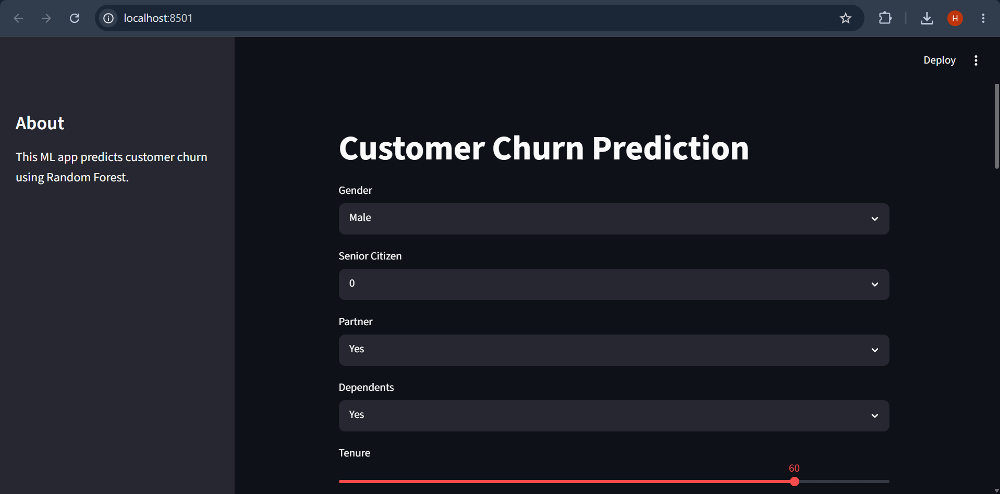
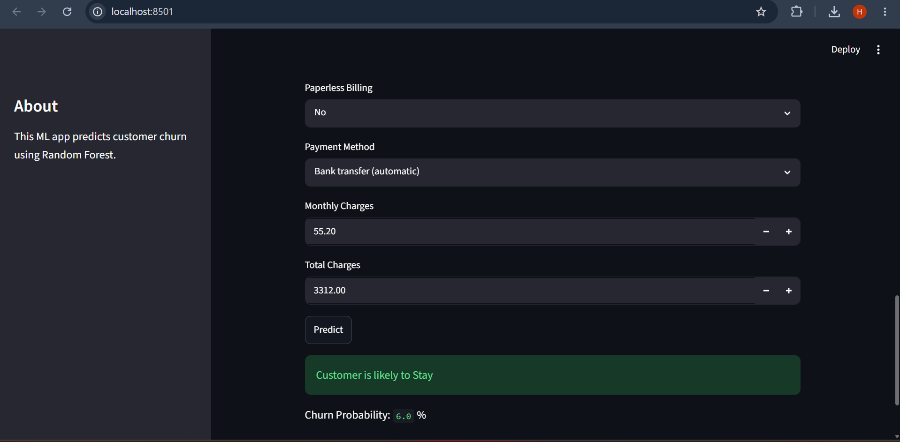
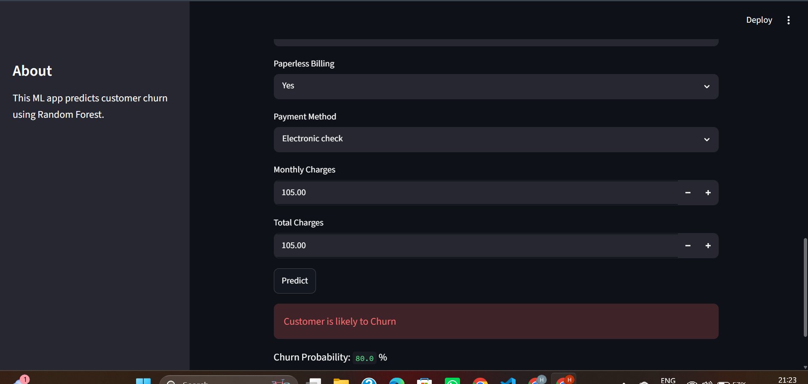

# Customer Churn Prediction System

## 📌 Project Overview

This project predicts whether a telecom customer is likely to churn (leave the service) or stay using Machine Learning. The application helps businesses identify customers at high risk of leaving so they can take preventive actions to improve customer retention.

---

## 🎯 Problem Statement

Customer churn is one of the biggest challenges for telecom companies. Losing existing customers leads to revenue loss and increased customer acquisition costs. This project uses customer demographics, account information, and service usage details to predict customer churn.


---

## 🌐 Connect with Me

- 💻 **GitHub:** https://github.com/Harshali2628
- 💼 **LinkedIn:** www.linkedin.com/in/harshali-panchal-771b6324a
- 🚀 **Live Demo:** https://customer-churn-prediction-yhoc8f2nt6aueuz9phpm64.streamlit.app

---

## ✨ Features

- Data Cleaning and Preprocessing
- Exploratory Data Analysis (EDA)
- Feature Engineering
- Random Forest Classification Model
- Real-time Customer Churn Prediction
- Interactive Streamlit Web Application

---

## 🛠️ Technologies Used

- Python
- Pandas
- NumPy
- Scikit-learn
- Streamlit
- Matplotlib
- Seaborn

---

## 📊 Model Performance

- Algorithm: Random Forest Classifier
- Accuracy: 87%
- Evaluation Metrics:
  - Accuracy Score
  - Confusion Matrix
  - Precision
  - Recall
  - F1-Score

---

## 🚀 How to Run

Clone the repository

```bash
git clone https://github.com/Harshali2628/Customer-Churn-Prediction.git
```

Install dependencies

```bash
pip install -r requirements.txt
```

Run the application

```bash
streamlit run app.py
```

---

## 📁 Project Structure

```text
Customer-Churn-Prediction/
│
├── data/
│   └── WA_Fn-UseC_-Telco-Customer-Churn.csv
│
├── models/
│   └── churn_model.pkl
│
├── screenshots/
│   ├── home.png
│   ├── stay_prediction.png
│   └── churn_prediction.png
│
├── app.py
├── churn_prediction.py
├── requirements.txt
├── README.md
└── .gitignore
```

---

## 📸 Application Screenshots

### App Page


### Stay Prediction


### Churn Prediction


---

## 📈 Future Improvements

- Hyperparameter tuning
- SHAP explainability
- ROC-AUC visualization
- Cloud deployment
- Improved UI

---

## 👩‍💻 Author

Harshali Panchal
